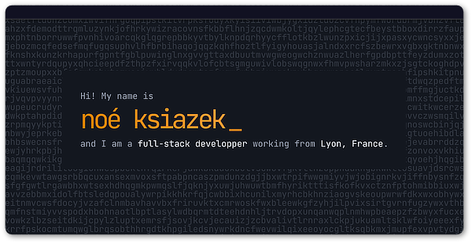

<div align="center">
      
    <h1>My Portfolio</h1>

<a aria-label="License" href="LICENSE">
    
</a>
  <a aria-label="Join the community on GitHub" href="https://ksiazek.xyz">
    
  </a>
</div>

## Description

This is a simple portfolio website that I created for myself. It is built with [React](https://react.dev/) and [PicoCSS](https://picocss.com/).
I used [Vite](https://vitejs.dev/) as a build tool, and [TypeScript](https://www.typescriptlang.org/) as a programming language. And I guess that's all there is to say about it. 😄

## Getting Started

Just clone the repository and run `npm install` to install all the dependencies.

To start a development server run:
```bash
$ npm run dev
```
... and if you want to build for production, run: 
```bash
$ npm run build
```

You can find a list of all available tasks in the [package.json]("package.json") file.

## License

It is open source because I see no reason to keep it private. But it will require some work to make it your own.
Feel free to use this project as inspiration, or even as a template, but please don't just copy it and publish it as your own. 
And whatever you do, don't forget to change my name. 😄